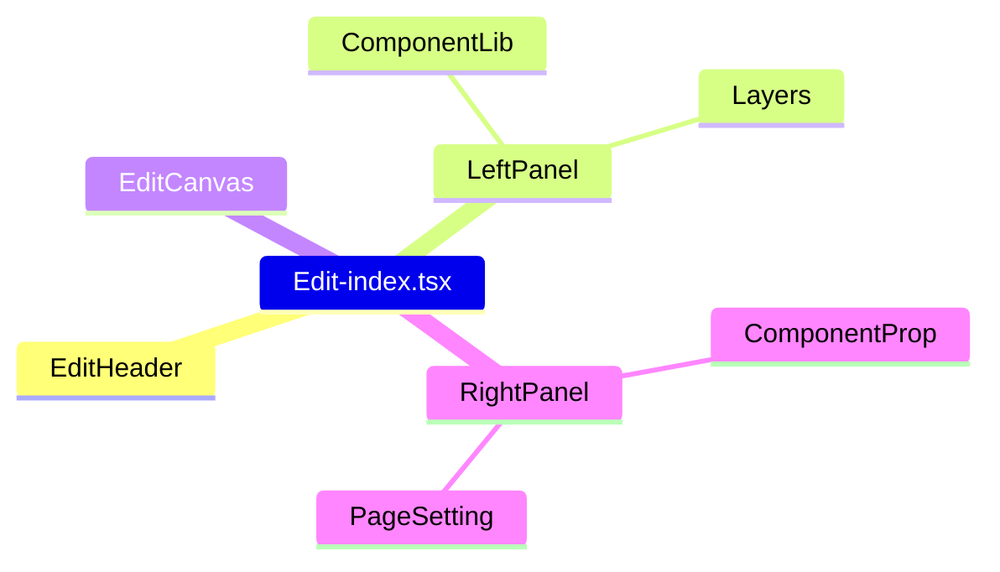

### Edit-index.tsx

1. primary consists of EditHeader, LeftPanel, EditCanvas, RightPanel.
2. Display the webpage's title.
3. Clear the selectedId when clicking the empty area of EditCanvas.

### EditHeader
#### Back button
return to the list page.
```jsx
<Button type="link" icon={<LeftOutlined/>} onClick={() => nav(-1)}>
    Back
</Button>
```

#### TitleElement

1. A editable Title component.
2. Switch between edit and view mode with useState.

#### SaveButton

1. used to save the questionnaire.
2. Call updateQuestionnaireService.

#### PublishButton
1. used to publish the questionnaire.
2. Call updateQuestionnaireService.

### LeftPanel

1. primary consists of ComponentLib and Layers.

#### ComponentLib
1. used to add components to the canvas.


